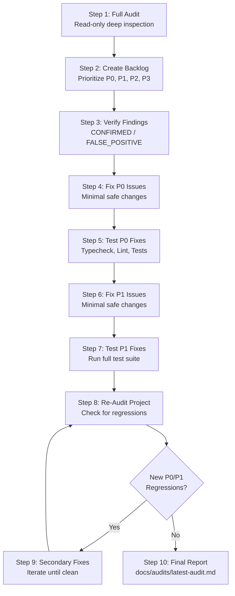

# Full Project Audit & Autonomous Repair Workflow

## Overview

This skill guides an agent through an autonomous, end-to-end audit, triage, verification, repair, and re-audit cycle for a production software project (covering backend, frontend, database, financial calculation invariants, and security).

The workflow operates **autonomously** without requiring manual user prompt pacing between steps, while strictly adhering to safety guardrails for destructive database actions, production credentials, and security controls.

---

## Operating Mode & Autonomy Standard

- **Autonomous Progression**: Advance automatically through each step:
  $$\text{AUDIT} \longrightarrow \text{BACKLOG} \longrightarrow \text{VERIFY} \longrightarrow \text{FIX P0} \longrightarrow \text{TEST P0} \longrightarrow \text{FIX P1} \longrightarrow \text{TEST P1} \longrightarrow \text{RE-AUDIT} \longrightarrow \text{FINAL REPORT}$$
- **When to Stop and Ask the User**:
  - A potentially destructive database operation is required (reset, drop, truncate, destructive migration).
  - Production data or production credentials are at risk.
  - Secrets/tokens/passwords need to be provisioned or altered.
  - Business requirements are materially ambiguous and cannot be safely inferred from existing tests/code.
  - A proposed fix requires a major architectural rewrite.
  - There are multiple conflicting business interpretations.
- Otherwise, proceed autonomously.

---

## Core Invariants & Safety Guardrails

### 1. General Safety Guardrails

- **DO NOT** delete data or drop database tables/schemas.
- **DO NOT** execute destructive migrations (`pnpm db:migrate:reset` or manual `DROP TABLE`).
- **DO NOT** remove authentication checks, disable authorization middleware, or weaken Zod validation schemas.
- **DO NOT** read, expose, print, or commit `.env` files or secrets.
- **DO NOT** weaken security controls or mock out security middleware merely to make test suites pass.

### 2. Financial Logic Invariants

When auditing or repairing applications handling wallets, transactions, budgets, or accounting:

- **Income**: Increases target wallet balance.
- **Expense**: Decreases target wallet balance.
- **Transfer**: Decreases source wallet balance, increases destination wallet balance. A transfer **must never** be counted as income or expense in revenue/spending analytics.
- **Transaction Update**: The financial effect of the old transaction state must be completely reversed before applying the new effect (within an atomic database transaction).
- **Transaction Deletion**: The financial effect of the deleted transaction must be completely reversed (wallet balance restored atomically).
- **Failed Mutations**: If any step in a multi-record mutation fails, all state changes must be rolled back to keep the database consistent.
- **Concurrency Protection**: Concurrent financial mutations on the same wallet or budget must use atomic row locking (`SELECT ... FOR UPDATE` or Prisma `$transaction` with optimistic/pessimistic concurrency controls) to prevent lost updates or negative balance race conditions.
- **Ownership & Tenant Isolation**: Never trust `userId` or `walletId` from client body or query params. Always verify that the authenticated user owns the resource being accessed or modified.

### 3. Timezone Invariants (Asia/Ho_Chi_Minh — UTC+7)

- The official business timezone is **`Asia/Ho_Chi_Minh` (UTC+7, +07:00)**.
- **Boundary Auditing**: All date filters, `startOfDay`, `endOfDay`, monthly aggregations, budget periods, reports, reminders, cron schedules, and daily quotas must be calculated in `Asia/Ho_Chi_Minh`.
- **Near-Midnight Invariant**: A transaction occurring at `23:59:59` or `00:00:01` Vietnam time must strictly belong to the correct Vietnam business calendar date, regardless of whether the server or database runs in UTC (`+00:00`).

---

## The 10-Step Execution Workflow



---

### Step 1 — Full Audit (Read-Only Deep Inspection)

Inspect the entire repository across all dimensions before modifying any file:

1. **Architecture & Structure**:
   - Request lifecycle (`Route -> Controller -> Service -> Repository -> Prisma/DB`).
   - Clean boundaries, dependency direction, circular dependencies, modularity.
2. **Backend & API Contracts**:
   - Request and response envelopes, HTTP status codes, error payload consistency.
   - Frontend and backend contract alignment (search for frontend API consumers in `api.ts` or client hooks).
3. **Authentication & Authorization**:
   - JWT validation, expiration, secret management, refresh token rotation, cookie security (`httpOnly`, `secure`, `sameSite`).
   - Role-based access control (RBAC), API key auth, ownership checks (preventing IDOR).
4. **Database, Prisma & PostgreSQL**:
   - Schema integrity, foreign keys, cascade rules, missing indexes on filtered/sorted columns.
   - N+1 queries, unindexed foreign keys, connection pooling, soft-delete handling (`deletedAt`).
5. **Financial Business Logic (if applicable)**:
   - Wallet balances, incomes, expenses, transfers, budget calculations, atomic balance updates.
   - Double-entry consistency, rounding issues, integer/decimal precision.
6. **Date & Timezone Compliance**:
   - Verify all `Date` calculations against `Asia/Ho_Chi_Minh` (UTC+7).
   - Ensure `startOfDay` and `endOfDay` do not use server local time (`setHours(0,0,0,0)` on UTC hosts).
7. **Performance & Concurrency**:
   - Race conditions, concurrent writes, unindexed queries, unbounded queries (missing pagination `take`/`skip`).
   - Memory leaks, streaming vs in-memory buffering for large exports or file downloads.
8. **Security & Input Validation**:
   - SSRF vulnerabilities in webhooks/fetch/axios, SQL injection, CSV formula injection.
   - Zod request body & query validation, sanitize untrusted crawled or user-supplied content.
9. **Error Handling & Logging**:
   - Structured error handling (`AppError`), unified error codes, no unhandled promise rejections.
   - No sensitive data or credentials in audit logs, application logs, or error responses.
10. **Testing & Tooling**:
    - Test coverage across services, repositories, controllers, workers.

> [!CAUTION]
> **DO NOT modify any code during Step 1.** Complete the full analysis first.

---

### Step 2 — Create Backlog

Convert all audit findings into a structured, prioritized backlog using the following severity definitions:

- **P0 — Critical**: Data corruption, financial balance loss, remote code execution, critical security vulnerabilities (SSRF, auth bypass, IDOR), critical race conditions, or application downtime.
- **P1 — High**: Production bugs, incorrect business logic, timezone day-boundary calculation errors, authorization flaws, severe performance bottlenecks, N+1 query loops, or broken API contracts.
- **P2 — Medium**: Edge-case errors, missing query validations, lack of pagination on non-hot endpoints, hardcoded non-production fallbacks, or lack of granular rate-limiting.
- **P3 — Low**: Code quality, architectural convention drift, minor CPU/memory optimizations, documentation inaccuracies, or cosmetic formatting.

#### Finding Entry Structure

For every finding recorded in the backlog:

- **ID**: e.g., `BUG-P0-01`, `BUG-P1-02`
- **Severity**: `P0` / `P1` / `P2` / `P3`
- **Module**: Feature/module directory name
- **File**: Relative file path (with clickable file link)
- **Line**: Line number range
- **Problem**: Concise technical description of the issue
- **Impact**: Concrete impact on business, security, or stability
- **Root Cause**: Underlying technical deficiency
- **Recommended Fix**: Step-by-step resolution plan
- **Required Tests**: Specific test cases to prove the bug is resolved and prevent regressions

#### Priority Order for Triage

1. Data corruption & data loss
2. Financial calculation and balance errors
3. Security vulnerabilities (SSRF, Auth/IDOR, Injection)
4. Race conditions & concurrency conflicts
5. Database consistency & unindexed bottlenecks
6. Timezone calculation bugs (`Asia/Ho_Chi_Minh`)
7. Production-breaking bugs & unhandled crashes
8. Performance bottlenecks (N+1 queries, unbounded memory)
9. Architecture & Maintainability

---

### Step 3 — Verify Findings

Before applying any code changes, rigorously verify every **P0** and **P1** finding to eliminate false positives:

1. **Trace Flow**: Follow the complete call chain (`Route -> Controller -> Service -> Repository -> Database`).
2. **Inspect Context**: Check related middleware, database constraints, Zod schemas, and existing tests.
3. **Classify Each Finding**:
   - `CONFIRMED`: Verified real issue with clear failure path. Proceed to fix.
   - `FALSE_POSITIVE`: Proved not an issue due to existing guards or constraints. Document rationale and discard.
   - `NEEDS_MORE_INVESTIGATION`: Ambiguous; inspect additional code paths or write an exploratory test before touching production code.

---

### Step 4 — Fix P0 Issues

Implement fixes for all `CONFIRMED` P0 findings adhering to these rules:

- **Smallest Safe Change**: Make the minimal diff necessary to fix the root cause.
- **Preserve Architecture**: Follow existing repository patterns and layered architecture.
- **No Unrelated Refactors**: Do not reformat or clean up unrelated code in the same change.
- **No Unnecessary Dependencies**: Use existing utilities and libraries whenever possible.
- **Preserve Contracts**: Do not alter public API response structures unless strictly required by the bug fix.
- **Prioritize Correctness**: For financial and security operations, prioritize correctness and safety over premature optimization.

---

### Step 5 — Test P0 Fixes

Validate that all P0 fixes are working and introduce no regressions:

1. **Run Validation Commands**:
   - Typecheck: `pnpm build` or `tsc --noEmit`
   - Linter: `pnpm lint`
   - Test Suite: `pnpm test -- --runInBand` or targeted `pnpm test -- <test-file>`
2. **Add Missing Tests**:
   - If tests are missing for a critical security or financial fix, write focused Jest/Node unit or integration tests covering:
     - Income/Expense/Transfer mutations
     - Wallet balance rollback on failure
     - Authorization & ownership boundary checks
     - Race condition & concurrency locking
     - Timezone date boundary at `00:00` and `23:59`
3. **If Tests Fail**:
   - Diagnose root cause, adjust implementation, and re-test until 100% green.
   - **Do not proceed to P1 fixes while any P0 issue or test remains failing.**

---

### Step 6 — Fix P1 Issues

Once P0 fixes are verified and green:

- Apply targeted, minimal fixes for all `CONFIRMED` P1 findings.
- Maintain the same strict standards: no architectural disruption, no breaking contract changes, minimal clean diff.

---

### Step 7 — Test P1 Fixes

1. Run the full verification suite (Typecheck, Lint, Unit tests, Integration tests, Frontend/Backend cross-checks).
2. Fix any regressions immediately.
3. Ensure the test suite is fully passing.

---

### Step 8 — Re-Audit

Perform a second full audit pass over the entire codebase to verify resolution and ensure no secondary issues were introduced:

- [ ] Were all original P0 and P1 findings genuinely resolved?
- [ ] Were any new security, concurrency, or timezone bugs introduced?
- [ ] Were API contracts between frontend and backend preserved?
- [ ] Were database transactions and atomic balance updates preserved?
- [ ] Are all database indexes and queries performing efficiently?
- [ ] Compare the re-audit state directly against the original backlog.

---

### Step 9 — Secondary Fixes (Convergence Loop)

If the re-audit uncovers new `CONFIRMED` P0 or P1 issues caused by recent edits:

1. Re-enter the loop: `VERIFY -> FIX -> TEST -> RE-AUDIT`.
2. Iterate until:
   - Zero confirmed P0 issues remain.
   - Zero confirmed P1 issues remain.
   - All tests pass cleanly.
   - Lint and typecheck pass with zero errors.
3. _Convergence limit_: If an issue cannot be resolved within 3 iterations without major architectural redesign, document it clearly in the report as `Deferred` and stop the loop.

---

### Step 10 — Final Report Generation

Create directory `docs/audits/` (if it does not exist) and write the final report to:
`docs/audits/latest-audit.md`

#### Report Structure Template

```markdown
# Project Audit & Repair Report

**Date**: YYYY-MM-DD
**Repository**: [Repository Name]
**Status**: [Clean / Action Required / Converged]

## Executive Summary

Concise 2–3 paragraph summary of the audit scope, critical issues discovered, fixes applied, test outcomes, and current repository health.

## Initial Findings Backlog

Summary table of all findings from Step 2 with Severity (P0, P1, P2, P3), Module, and Status (Fixed / Verified / Deferred).

## Fixed Issues Detail

### [BUG-P0-01] [Issue Title]

- **Severity**: P0
- **Module**: [module]
- **Root Cause**: [explanation]
- **Fix Applied**: [technical summary of change]
- **Files Changed**: [list of files with links]
- **Tests Added / Run**: [test paths]
- **Verification Result**: CONFIRMED FIXED

[... repeat for all fixed P0 and P1 issues ...]

## Test Execution Summary

- **Typecheck**: PASSED
- **Lint**: PASSED
- **Unit & Integration Tests**: [X] passed, 0 failed
- **New Tests Added**: [list of new test suites]

## Re-Audit Results

Detailed checklist proving no secondary regressions, contract breakages, or timezone errors remain.

## Remaining & Deferred Issues (P2 / P3)

List of non-blocking P2 and P3 issues scheduled for future maintenance cycles with recommended remediation.

## Risk Assessment & Next Steps

- Remaining operational or infrastructure risks.
- Actionable recommendations for the development team.
```

---

## Final Output Summary

Upon completion of the workflow, output a clear, concise terminal summary:

- **P0 Fixed**: Total count and IDs
- **P1 Fixed**: Total count and IDs
- **P2 / P3 Remaining**: Total count and IDs
- **Test Suite Status**: Total passed / failed
- **Files Modified**: List of touched files
- **Report Location**: `docs/audits/latest-audit.md`
